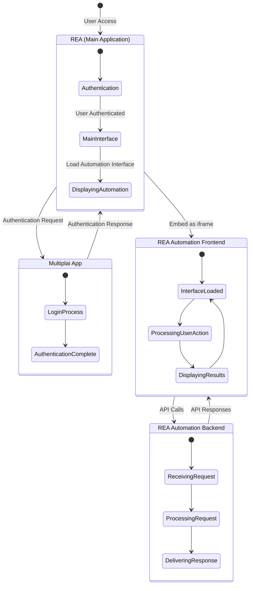

# Getting Started

## Required Technologies

- Windows Subsystem Linux (WSL) - skip if mac
    - How to install: <https://learn.microsoft.com/en-us/windows/wsl/install>
- Docker
    - How to install (windows): <https://docs.docker.com/desktop/setup/install/windows-install/>
    - How to install (mac): <https://docs.docker.com/desktop/setup/install/mac-install/>
- Node Version Manager (NVM)
    - How to install: <https://github.com/nvm-sh/nvm?tab=readme-ov-file#install--update-script>
- Git
    - How to install (ubuntu): ```sudo apt install git```
    - How to install (mac): ```brew install git```

## Repositories

- REA
    - <https://bitbucket.org/go-va_dev/rea-beta-backend/src/master/>
    - <https://bitbucket.org/go-va_dev/rea-beta-frontend/src/master/>
- REA Automation Backend
    - <https://bitbucket.org/go-va_dev/rea-n8n/src/master/>
- REA Automation Frontend
    - <https://bitbucket.org/go-va_dev/rea-automation-fe/src/master/>

## Application Relationship State Diagram


