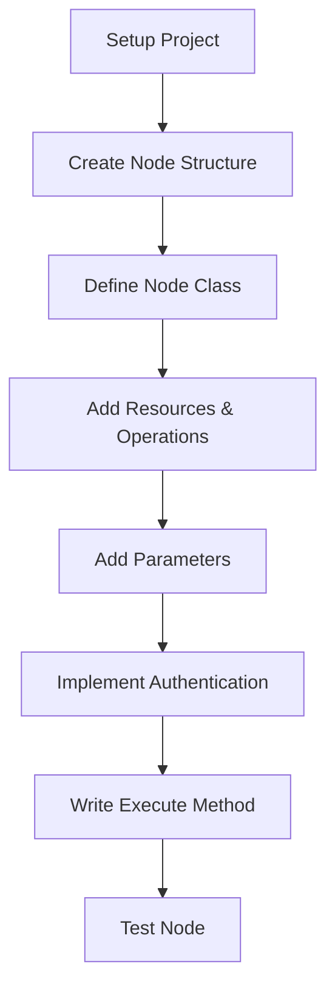
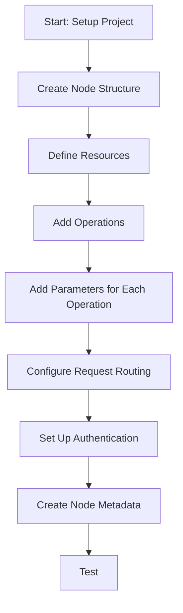
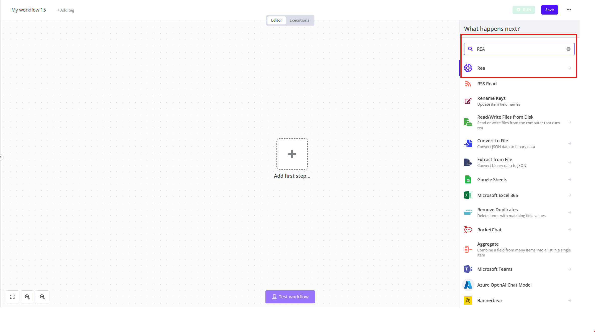
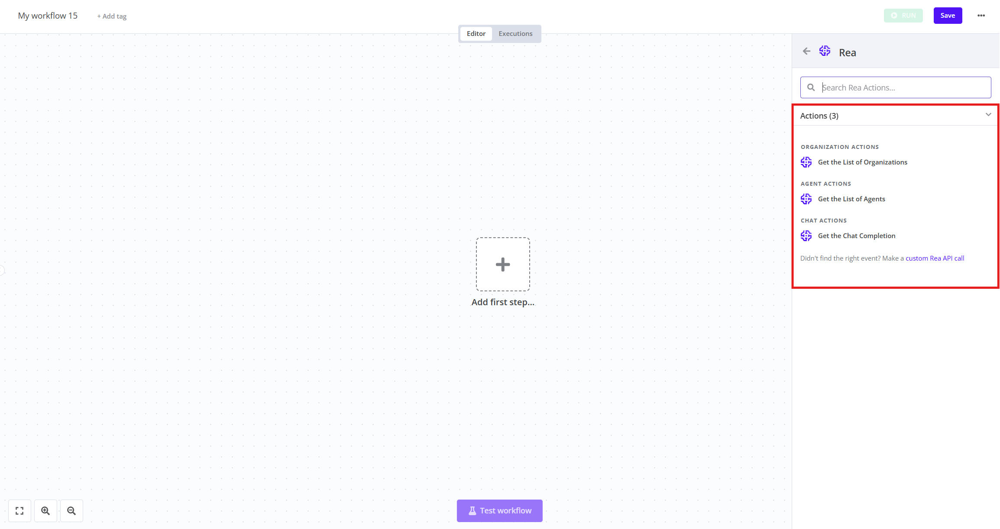
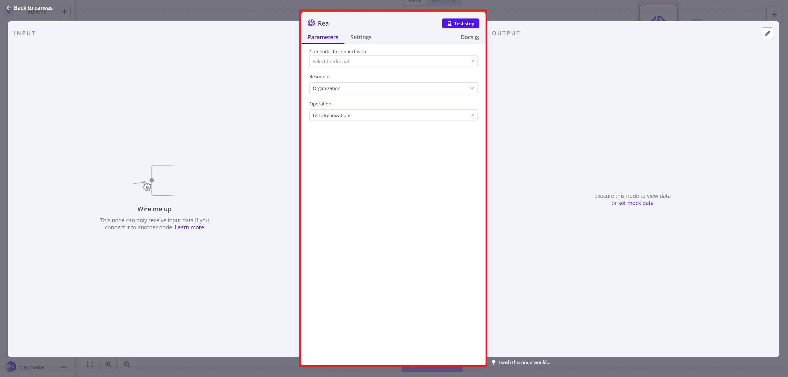

# How to Create a Node

## When to Choose Programmatic vs Declarative

- Choose Programmatic when you need complex logic, custom error handling, or are integrating with non-RESTful APIs.
- Choose Declarative when integrating with standard RESTful APIs that don't require complex processing logic.

<hr />

## Programmatic Style

This guide presents a straightforward approach to creating a programmatic-style node in n8n. This approach offers several advantages:

- Full Flexibility and Control
- Complex Logic Implementation
- Advanced API Integration
- Performance Optimization
- Custom Data Processing
- Dynamic Parameter Handling
- Legacy API Support

### Prerequisites

- Node.js (minimum v18.17.0) and npm
- Git
- Basic understanding of TypeScript
- Familiarity with REST APIs
- Understanding of n8n expressions

### Key Steps to Build Your Node

#### 1. Project Setup

1. Clone the REA Automation Backend repo
2. Create directories for your node in custom_nodes folder:
   - `nodes/YourNodeName/`
   - `credentials/YourNodeNameApi.credentials.ts`

#### 2. Node Structure (Core Files)

You'll need to create these essential files:

- `nodes/YourNode/YourNode.node.ts` - Main node code
- `nodes/YourNode/YourNode.node.json` - Node metadata
- `credentials/YourNodeApi.credentials.ts` - Authentication

#### 3. Define Your Node Class

```typescript
// YourNode.node.ts
import {
  IExecuteFunctions,
  INodeType,
  INodeTypeDescription,
  INodeExecutionData,
} from 'n8n-workflow';

export class YourNode implements INodeType {
  description: INodeTypeDescription = {
    // Basic node details
    displayName: 'Your Node Name',
    name: 'yourNodeName',
    icon: 'file:yourNode.svg',
    group: ['transform'],
    version: 1,
    description: 'Description of what your node does',
    defaults: { name: 'Your Node' },
    inputs: ['main'],
    outputs: ['main'],
    
    // Credentials reference
    credentials: [
      {
        name: 'yourApiCredentials',
        required: true,
      },
    ],
    
    // UI elements definition
    properties: [
      // Properties will be defined here
    ],
  };

  // Execute method - runs when node is executed
  async execute(this: IExecuteFunctions): Promise<INodeExecutionData[][]> {
    // Implementation details go here
  }
}
```

#### 4. Define Resources and Operations

```typescript
// Inside properties array
{
  displayName: 'Resource',
  name: 'resource',
  type: 'options',
  noDataExpression: true,
  options: [
    { name: 'Contact', value: 'contact' },
    // Add more resources as needed
  ],
  default: 'contact',
},
{
  displayName: 'Operation',
  name: 'operation',
  type: 'options',
  noDataExpression: true,
  displayOptions: {
    show: { resource: ['contact'] },
  },
  options: [
    { name: 'Create', value: 'create' },
    { name: 'Get', value: 'get' },
    // Add more operations as needed
  ],
  default: 'create',
},
```

#### 5. Add Operation Parameters

```typescript
// Parameters for create operation
{
  displayName: 'Email',
  name: 'email',
  type: 'string',
  required: true,
  displayOptions: {
    show: {
      resource: ['contact'],
      operation: ['create'],
    },
  },
  default: '',
  description: 'Primary email for the contact',
},
```

#### 6. Implement Authentication

```typescript
// YourNodeApi.credentials.ts
import {
  IAuthenticateGeneric,
  ICredentialType,
  INodeProperties,
} from 'n8n-workflow';

export class YourNodeApi implements ICredentialType {
  name = 'yourNodeApi';
  displayName = 'Your API';
  
  properties: INodeProperties[] = [
    {
      displayName: 'API Key',
      name: 'apiKey',
      type: 'string',
      default: '',
    },
  ];
  
  authenticate: IAuthenticateGeneric = {
    type: 'generic',
    properties: {
      headers: {
        'Authorization': '=Bearer {{$credentials.apiKey}}'
      },
    },
  };
}
```

#### 7. Execute Method Implementation

```typescript
// Inside the execute method
async execute(this: IExecuteFunctions): Promise<INodeExecutionData[][]> {
  const items = this.getInputData();
  const returnData = [];
  const resource = this.getNodeParameter('resource', 0) as string;
  const operation = this.getNodeParameter('operation', 0) as string;

  // Process each item (supports batching)
  for (let i = 0; i < items.length; i++) {
    if (resource === 'contact') {
      if (operation === 'create') {
        // Get parameters
        const email = this.getNodeParameter('email', i) as string;
        
        // Make API request
        const options = {
          headers: { 'Accept': 'application/json' },
          method: 'POST',
          body: { email },
          uri: 'https://api.example.com/v3/contacts',
          json: true,
        };
        
        // Process response
        const response = await this.helpers.requestWithAuthentication.call(
          this,
          'yourNodeApi',
          options,
        );
        
        returnData.push(response);
      }
    }
  }

  // Return data in n8n format
  return [this.helpers.returnJsonArray(returnData)];
}
```

### Critical Aspects to Remember

1. **Class and File Names**: Ensure class name matches file name (e.g., `YourNode` class in `YourNode.node.ts`).

2. **Resource/Operation Pattern**: Structure node UI with resources and operations for consistent user experience.

3. **Input Processing**: Handle multiple input items with a loop to support batch operations.

4. **Error Handling**: Include proper error handling in your execute method.

5. **Parameter Types**: Use appropriate parameter types (string, number, boolean, etc.) with correct validation.

6. **Credentials Management**: Link credentials properly and handle authentication securely.

7. **Testing**: Test your node with different input combinations and edge cases.

8. **Documentation**: Provide clear descriptions for all parameters and operations.

### Development Flow



The programmatic approach gives you full control over execution flow and allows for complex logic implementation when needed.

For more information in creating programmatic node, [Go here](https://docs.n8n.io/integrations/creating-nodes/build/programmatic-style-node/).

<hr />

## Declarative Style

### What is a Declarative-Style Node?

A declarative-style node in n8n defines node functionality using structured objects rather than imperative code. This approach offers several advantages:

- More maintainable code
- Easier to read and understand
- Less prone to bugs
- Better suited for integrations with RESTful APIs

### Prerequisites

- Node.js (minimum v18.17.0) and npm
- Basic understanding of TypeScript
- Familiarity with REST APIs

### Step-by-Step Guide

#### 1. Project Setup

1. Clone the REA Automation Backend repo
2. Create directories for your node in custom_nodes folder:
   - `nodes/YourNodeName/`
   - `credentials/YourNodeNameApi.credentials.ts`

#### 2. Node Structure

Create your main node file with this basic structure:

```typescript
import { INodeType, INodeTypeDescription } from 'n8n-workflow';

export class YourNode implements INodeType {
    description: INodeTypeDescription = {
        // Node definition goes here
        displayName: 'Your Node Name',
        name: 'yourNodeName',
        icon: 'file:yourNode.svg',
        group: ['transform'],
        version: 1,
        description: 'Description of what your node does',
        defaults: {
            name: 'Your Node',
        },
        inputs: ['main'],
        outputs: ['main'],
        properties: [
            // Properties will be defined here
        ]
    };
}
```

#### 3. Define Resources and Operations

The key to declarative-style nodes is organizing functionality into resources and operations:

```typescript
properties: [
    // 1. Define Resource selector
    {
        displayName: 'Resource',
        name: 'resource',
        type: 'options',
        noDataExpression: true,
        options: [
            {
                name: 'User',
                value: 'user',
            },
            // Add more resources as needed
        ],
        default: 'user',
    },
    // 2. Define Operations for each resource
    {
        displayName: 'Operation',
        name: 'operation',
        type: 'options',
        noDataExpression: true,
        displayOptions: {
            show: {
                resource: ['user'],
            },
        },
        options: [
            {
                name: 'Create',
                value: 'create',
            },
            {
                name: 'Get',
                value: 'get',
            },
            // Add more operations as needed
        ],
        default: 'get',
    }
]
```

#### 4. Add Operation Parameters

Add fields that are specific to each operation:

```typescript
// Fields for 'create' operation
{
    displayName: 'Name',
    name: 'name',
    type: 'string',
    required: true,
    displayOptions: {
        show: {
            resource: ['user'],
            operation: ['create'],
        },
    },
    default: '',
    description: 'Name of the user',
},
// Fields for 'get' operation
{
    displayName: 'User ID',
    name: 'userId',
    type: 'string',
    required: true,
    displayOptions: {
        show: {
            resource: ['user'],
            operation: ['get'],
        },
    },
    default: '',
    description: 'ID of the user to retrieve',
},
```

#### 5. Configure Request Routing

The power of declarative nodes comes from the `routing` object that defines how requests are made:

```typescript
{
    displayName: 'User ID',
    // ...other properties
    routing: {
        request: {
            method: 'GET',
            url: '/api/users/{{$value}}',
        },
    },
}
```

For more complex routing:

```typescript
// At the operation level
{
    displayName: 'Operation',
    // ...other properties
    routing: {
        request: {
            method: '={{$parameter["operation"] === "get" ? "GET" : "POST"}}',
            url: '={{"/api/" + $parameter["resource"] + ($parameter["operation"] === "get" ? "/" + $parameter["userId"] : "")}}',
            body: '={{$parameter["operation"] === "create" ? { name: $parameter["name"] } : undefined}}',
        },
    },
}
```

#### 6. Authentication

For APIs requiring authentication, create a credentials file:

```typescript
import {
    IAuthenticateGeneric,
    ICredentialType,
    INodeProperties,
} from 'n8n-workflow';

export class YourApiCredentials implements ICredentialType {
    name = 'yourApiCredentials';
    displayName = 'Your API Credentials';
    
    properties: INodeProperties[] = [
        {
            displayName: 'API Key',
            name: 'apiKey',
            type: 'string',
            default: '',
        },
    ];
    
    authenticate: IAuthenticateGeneric = {
        type: 'generic',
        properties: {
            headers: {
                'Authorization': '=Bearer {{$credentials.apiKey}}'
            },
        },
    };
}
```

#### 7. Node Metadata

Create a JSON file for node metadata:

```json
{
    "node": "n8n-nodes-base.YourNodeName",
    "nodeVersion": "1.0",
    "codexVersion": "1.0",
    "categories": ["Miscellaneous"],
    "resources": {
        "credentialDocumentation": [
            {
                "url": "https://docs.yourapi.com/authentication"
            }
        ],
        "primaryDocumentation": [
            {
                "url": "https://docs.yourapi.com/api-reference"
            }
        ]
    }
}
```

### Key Points to Remember

1. **Resource/Operation Structure**: Always organize your node using resources and operations for clear UI organization.

2. **Display Options**: Use `displayOptions` with `show` and `hide` properties to create dynamic UI that changes based on selections.

3. **Routing Object**: The `routing` object is what makes declarative nodes powerful - it defines API requests based on user inputs.

4. **Expression Support**: Use expressions (`={{...}}`) to create dynamic values in routing parameters.

5. **Field Organization**: Group related fields together and provide clear descriptions for better user experience.

6. **Authentication**: Properly implement credentials for secure API access.

7. **Testing**: Test all combinations of resources and operations to ensure functionality.

### Flow Diagram



This approach allows you to create powerful nodes with minimal code, relying on n8n's framework to handle the complexity of making API requests and processing responses.

For more information in creating declarative node, [Go here](https://docs.n8n.io/integrations/creating-nodes/build/declarative-style-node/).

<hr>

## How to verify if node has been added to the system

### Figure 1

Based on the three screenshots, I can provide a description of the final step to check if a node has been successfully added to the application:

The screenshots show a workflow automation interface where a REA node is being added to "My workflow 15".



In the first screenshot, we see the initial workflow interface with a search field and "REA" node selected from available options. The interface shows various integrations like RSS Read, Google Sheets, Microsoft Excel, etc. with a central "Add first step..." placeholder.

The second screenshot shows the REA node actions selection menu, displaying three available actions:



- ORGANIZATION ACTIONS: "Get the List of Organizations"
- AGENT ACTIONS: "Get the List of Agents" 
- CHAT ACTIONS: "Get the Chat Completions"

The third and final screenshot confirms the successful addition of the REA node to the workflow. This verification is evident from:



1. The node appearing on the canvas with "Wire me up" message
2. The configuration panel opening on the right side showing:
    - Parameters tab (selected) with fields for connecting an account and selecting operations
    - Settings tab option
    - A "Run once" button at the top
3. INPUT and OUTPUT sections visible on the canvas
4. A message indicating "This node can only receive input once. If you connect it to another node, Learn more"

This final screenshot confirms the node has been successfully added to the application and is now ready for configuration and connection to other workflow elements.