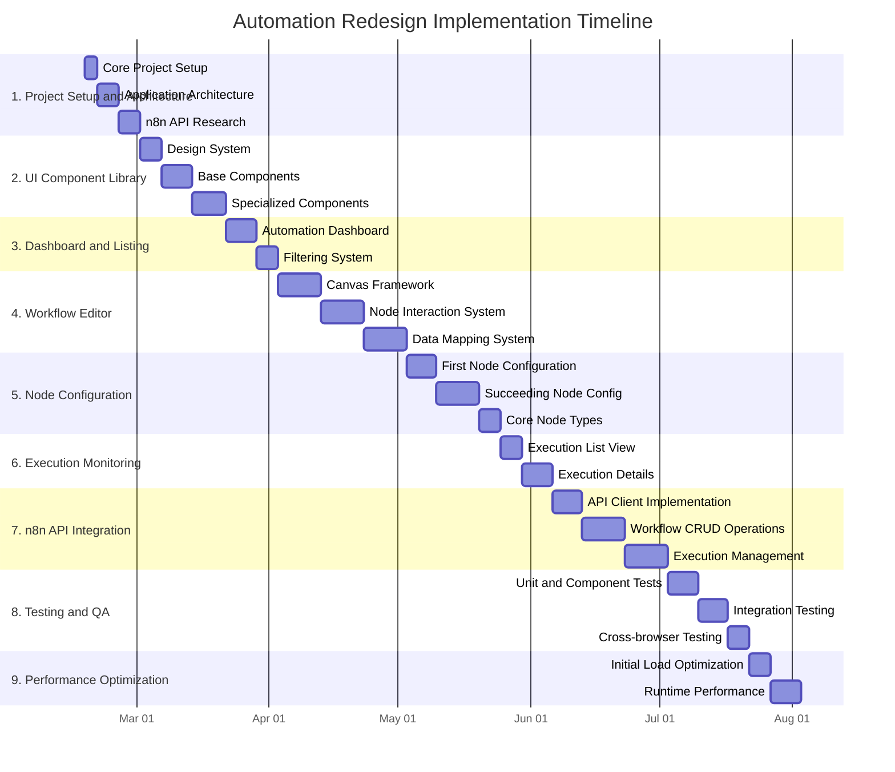
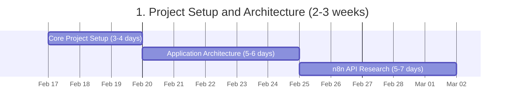
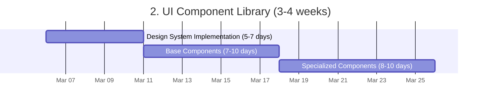
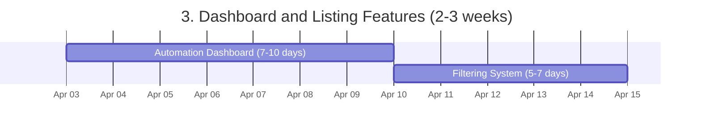
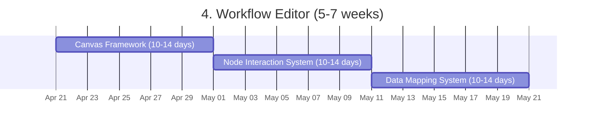
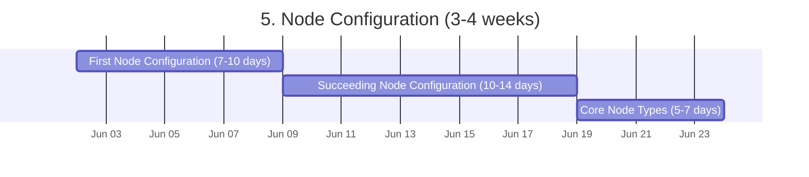
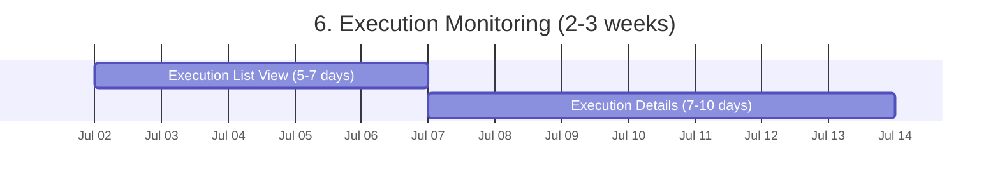
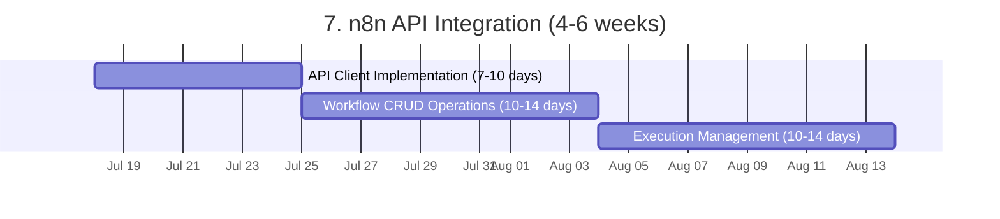
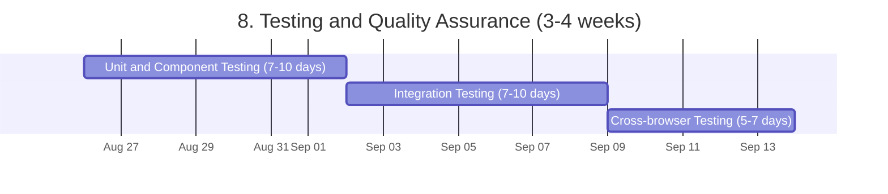
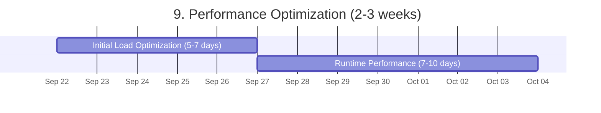

# Automation Redesign Implementation Time Estimate

Based on detailed analysis of the provided design files, here's a comprehensive breakdown of implementation time required for a mid-level frontend developer to build this automation system in Vue.js/Nuxt, integrating with n8n API.

## Complete Project Timeline Overview

## Timeline Summary

- Project Start: February 17, 2025
- Project End (minimum duration): October 7, 2025
- Total Duration: Approximately 33 weeks (8.25 months)

This timeline is based on the minimum duration estimates for each task and assumes sequential execution. The actual implementation time may vary based on team size, concurrent development possibilities, and any challenges encountered during development.

## 1. Project Setup and Architecture (2-3 weeks)

- **Core Project Setup (3-4 days)**
  - Nuxt.js project initialization
  - TypeScript configuration
  - Linting and formatting setup
  - Testing framework integration

- **Application Architecture (5-6 days)**
  - State management with Vuex/Pinia
  - Routing structure
  - Component hierarchy design
  - API service pattern

- **n8n API Research and Planning (5-7 days)**
  - Exploring n8n codebase to understand data structures
  - Identifying required endpoints
  - Planning data transformation layer
  - Documenting integration points

## 2. UI Component Library (3-4 weeks)

- **Design System Implementation (5-7 days)**
  - Color palette and variables
  - Typography and spacing
  - Animation standards
  - Responsive breakpoints

- **Base Components (7-10 days)**
  - Buttons, inputs, selectors, toggles
  - Cards and list items
  - Modal dialogs and tooltips
  - Tabs and navigation elements

- **Specialized Components (8-10 days)**
  - Node visualization components
  - Connection lines with SVG
  - Status indicators
  - Filter components
  - Drag-and-drop utilities

## 3. Dashboard and Listing Features (2-3 weeks)

- **Automation Dashboard (7-10 days)**
  - Main grid layout with cards
  - Folder navigation structure
  - Empty states
  - Creation flows

- **Filtering System (5-7 days)**
  - Filter modal implementation
  - Date range selector
  - Status filters
  - Search functionality

## 4. Workflow Editor (5-7 weeks)

- **Canvas Framework (10-14 days)**
  - Node rendering and positioning
  - Connection lines with proper curvature
  - Canvas panning/zooming
  - Selection and multi-selection

- **Node Interaction System (10-14 days)**
  - Add node panel with categorization
  - Node connection logic
  - Contextual node actions
  - Visual feedback systems

- **Data Mapping System (10-14 days)**
  - Drag-and-drop field mapping
  - Data type validation
  - Visual data flow indicators
  - Input/output visualization

## 5. Node Configuration (3-4 weeks)

- **First Node Configuration (7-10 days)**
  - Trigger type selection
  - Dynamic form generation
  - Help text and tooltips
  - Validation systems

- **Succeeding Node Configuration (10-14 days)**
  - Input field mapping interface
  - Parameter configuration
  - Field preview functionality
  - Testing capabilities

- **Core Node Types (5-7 days)**
  - Implementing unique UI for different node types
  - Handling specialized configurations
  - Template management

## 6. Execution Monitoring (2-3 weeks)

- **Execution List View (5-7 days)**
  - Execution history with status indicators
  - Timeline representation
  - Filtering and sorting

- **Execution Details (7-10 days)**
  - Step-by-step visualization
  - Success/failure indicators
  - Data inspection tools
  - Execution replay options

## 7. n8n API Integration (4-6 weeks)

- **API Client Implementation (7-10 days)**
  - Authentication handling
  - Request/response normalization
  - Error management

- **Workflow CRUD Operations (10-14 days)**
  - Creating/updating workflows
  - Node configuration persistence
  - Validation and error handling

- **Execution Management (10-14 days)**
  - Execution triggering
  - Execution monitoring
  - Real-time updates (WebSockets or polling)
  - Data transformation layers

## 8. Testing and Quality Assurance (3-4 weeks)

- **Unit and Component Testing (7-10 days)**
  - Testing individual components
  - State management tests
  - Utility function tests

- **Integration Testing (7-10 days)**
  - Testing component interaction
  - API integration tests
  - Workflow creation/execution tests

- **Cross-browser Testing (5-7 days)**
  - Testing across major browsers
  - Responsive design validation
  - Performance testing

## 9. Performance Optimization (2-3 weeks)

- **Initial Load Optimization (5-7 days)**
  - Code splitting
  - Asset optimization
  - Critical path rendering

- **Runtime Performance (7-10 days)**
  - Workflow editor optimization
  - Large dataset handling
  - Memory management
  - Animation performance

## Potential Bottlenecks and Specialized Knowledge Requirements

1. **n8n API Integration (High Risk)**
   - Lack of formal documentation will significantly slow development
   - Requires exploratory work in n8n codebase
   - Potential for significant rework as understanding evolves

2. **Canvas Rendering Performance (Medium Risk)**
   - Complex workflow visualization with many nodes may cause performance issues
   - Requires expertise in efficient SVG/Canvas rendering

3. **Drag-and-Drop Field Mapping (Medium Risk)**
   - Complex interaction patterns need precise implementation
   - Coordinating visual feedback with data binding is challenging

4. **State Management Complexity (Medium Risk)**
   - Managing complex workflow state with many interdependent nodes
   - Handling undo/redo functionality for workflow changes

5. **Real-time Updates (Medium Risk)**
   - Implementing efficient execution monitoring
   - Handling potential network interruptions gracefully

## Total Implementation Time

For a frontend developer working independently:

- **Minimum Estimate: 26 weeks (6.5 months)**
- **Realistic Estimate: 32 weeks (8 months)**
- **Maximum Estimate: 36 weeks (9 months)**

With a team of three mid-level developers working collaboratively:
- **Realistic Estimate: 16-20 weeks (4-5 months)** accounting for coordination overhead

## Key Implementation Recommendations

1. **Early n8n API Research**: Begin by deeply understanding the n8n API structure before committing to implementation details

2. **Phased Approach**: Implement core functionality first, then add more complex features

3. **Component-First Development**: Build and test individual components before integrating them into the larger system

4. **Progressive Enhancement**: Start with basic functionality and layer in more complex interactions

5. **Regular Performance Testing**: Monitor performance impact with each major feature addition